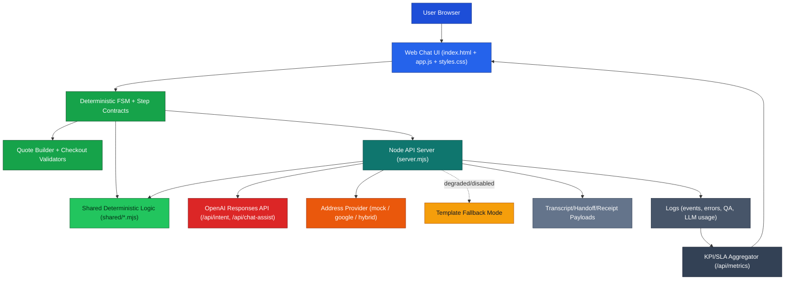
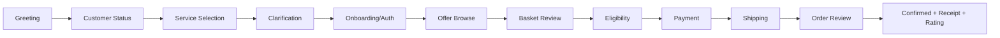

# Bell-Style Agentic Sales Chatbot

Conversational, sales-first telecom assistant with deterministic checkout logic, KPI/SLA telemetry, and optional ChatGPT-assisted language.

---

## Overview

This project implements a Bell-style sales chatbot that guides users through:

- Service discovery (`mobility`, `home internet`, `landline`, `bundle`)
- Offer browsing and cross-sell flow
- Basket, eligibility, payment, shipping, and order confirmation
- Corporate-style receipt generation
- Metrics, SLA monitoring, and QA event logging

The system uses a **Hybrid FSM + LLM** design:

- FSM controls business-critical transitions and validations.
- ChatGPT is assistive for fluency, intent/entity help, summaries, and multilingual phrasing.

---

## Problem Statement

Digital telecom purchase flows often drop users due to:

- unclear next steps,
- fragmented checkout experiences,
- weak cross-sell sequencing,
- missing observability on where users fail.

This assistant addresses that with deterministic flow control, guided payment/address handling, and sales-grade KPI monitoring.

---

## Who It Is For

- **Sales teams:** improve conversion, bundle attach rate, and checkout completion.
- **Product owners:** test new funnel logic quickly in a controlled prototype.
- **Operations leaders:** monitor SLA breaches and interaction quality from logs.

---

## Product Demo / Screenshots / Video

Add screenshots or demo links here:

- Chat start and service intake
- Offer carousel and cross-sell
- Basket and checkout
- Receipt
- KPI and SLA dashboard

Recommended folder: `assets/screenshots/`

---

## Project Documents

- Final Report: 
- Demo Script: 
---

## System Architecture



**Color key:** Red = external AI calls, Green = deterministic business logic, Blue/Teal = app runtime path, Orange = provider/fallback controls, Slate = telemetry/export artifacts.

---

## Conversation Flow (State-Machine)



---

## Safety and Source-of-Truth Boundaries

### ChatGPT can be used for

- conversational fluency
- intent/entity detection support
- sales discovery phrasing
- recommendation explanation
- summarization
- multilingual responses
- handoff summaries

### ChatGPT is **not** source-of-truth for

- exact pricing
- promo eligibility
- credit decisions
- contract terms
- inventory counts
- billing balances
- order confirmation
- payment execution

Deterministic business logic in `app.js`, `shared/*.mjs`, and server endpoints remains authoritative.

---

## Core Capabilities

- Sales-first guided flow with explicit step contracts
- Existing/new customer onboarding and authentication variants
- Mid-conversation language switching (EN/FR/ES/ZH) for future prompts and option labels
- Address lookup (`mock|google|hybrid`) and typeahead support with Toronto-first ranking in Google mode
- Nearby Bell store finder with entered-address or current-location mode and 0-50 km radius control
- Guided Quote Builder (budget/speed/device-cost weighting + side-by-side ranked options)
- Quote preference hard-lock to `100` total points across budget/speed/device cost
- Offer carousel, bundle discount logic, and cross-sell prompts
- Brand-scoped mobility offers (iPhone/Samsung/Pixel filtering)
- Guided card entry (brand detection + Luhn + CVC + postal validation)
- Mock financing path with approval/decline flow
- Mon-Thu booking calendar with Friday meeting-request fallback
- Assist-only SSE streaming (`/api/chat-assist-stream`) with automatic fallback to `/api/chat-assist`
- Post-intake automation webhook trigger (`/api/automations/post-intake`) with safe no-op when not configured
- First-time animated onboarding walkthrough with replay control and localStorage persistence
- Agentic tool routing (`/api/agent-router`) and per-request trace IDs
- Deterministic LLM safety guardrails with multilingual/leet normalization and policy categories
- Corporate-style printable receipt
- Chat end/refresh session lifecycle controls
- KPI + SLA dashboard data via `/api/metrics`
- LLM health status with connected/degraded indicators

---

## Current Status

### Implemented

- Hybrid LLM endpoints: `/api/intent`, `/api/chat-assist`, `/api/chat-assist-stream`, `/api/llm-health`
- Agent router endpoint: `/api/agent-router`
- Deterministic quote ranking endpoint: `/api/quote-preview`
- Finder endpoint with fallback providers: `/api/finder/nearby`
- Post-intake automation endpoint: `/api/automations/post-intake`
- Compliance endpoints: `/api/compliance-status`, `/api/consent-record`
- Export/handoff endpoints: `/api/handoff-summary`, `/api/transcript-export`
- Metrics and SLA aggregation with monthly snapshots and session rollups
- Validation utilities for Canadian phone/email/postal/card checks
- Structured tests across routing, metrics, utils, LLM integration, SSE, automation, finder, onboarding, and agentic evals
- Checkout continuity hardening for internet, mobility, and landline paths
- Calendar booking UI with weekday availability controls

### In Progress / Next

- richer quote building and plan comparison
- stronger CRM handoff and campaign attribution
- production deployment wiring for webhook/telemetry destinations

---

## Roadmap

### Now

- Stabilize conversion-critical path and remove residual flow friction.
- Improve contextual promo messaging and bundle explanation.

### Next

- Multi-service quote builder expansion (mobility + landline parity)
- Offer Explainability Layer (“why this recommendation”)
- Cross-Sell Optimizer with decline suppression
- Checkout confidence signals (address confidence, payment recovery)

### Later

- Post-purchase order tracker timeline
- Agent handoff packet + lead scoring
- Full evaluation harness and monthly benchmark reporting

Detailed backlog: [docs/FEATURE_EXPANSION_BACKLOG.md](/Users/alexkatzighera/Documents/NLP%20Google%20Chatbot/docs/FEATURE_EXPANSION_BACKLOG.md)

---

## Quick Start (Local)

### 1) Configure environment

```bash
cp .env.example .env.local
```

Set `OPENAI_API_KEY` in `.env.local` for ChatGPT connectivity.

### 2) Run server

```bash
node server.mjs
```

If port `3000` is busy:

```bash
PORT=3001 node server.mjs
```

### 3) Open app

- [http://127.0.0.1:3000](http://127.0.0.1:3000)
- or [http://127.0.0.1:3001](http://127.0.0.1:3001)

---

## Environment Variables

| Variable | Default | Purpose |
|---|---|---|
| `PORT` | `3000` | Local server port |
| `OPENAI_API_KEY` | empty | Enables ChatGPT-backed assist calls |
| `OPENAI_MODEL` | `gpt-4.1-mini` | LLM model for assist and intent |
| `LLM_ENABLED` | `true` | Toggle LLM path vs template fallback |
| `ADDRESS_PROVIDER` | `mock` | `mock`, `google`, or `hybrid` |
| `GOOGLE_PLACES_API_KEY` | empty | Google Places autocomplete + nearby finder (optional) |
| `LLM_USAGE_LOG_PATH` | `./logs/llm-usage.log` | Token/cost usage log path |
| `N8N_WEBHOOK_URL` | empty | Post-intake automation webhook target (optional) |
| `FINDER_DEFAULT_RADIUS_METERS` | `8000` | Default finder radius when query radius is omitted |
| `SSE_ASSIST_ENABLED` | `true` | Feature flag for assist SSE endpoint behavior |
| `LANGSMITH_TRACING_ENABLED` | `false` | Enables trace forwarding to external observability endpoint |
| `LANGSMITH_ENDPOINT` | empty | Trace forwarding endpoint URL |
| `LANGSMITH_API_KEY` | empty | Optional API key for trace forwarding |

Address lookup behavior:

- `mock`: deterministic local suggestions for testing/demo
- `google` / `hybrid`: Google Places suggestions only, ranked Toronto-first (Toronto bias, not a hard city restriction)
- If Google returns no results or is unavailable, the chat allows manual address entry (no forced block)
- Finder behavior: uses entered service address when available (or current location), searches Bell stores via Google Places, and keeps Overpass as fallback for resilience

---

## API Reference

### Implemented Endpoints

- `POST /api/log` - structured event logging
- `POST /api/intent` - intent classification (LLM + fallback)
- `POST /api/agent-router` - deterministic agent tool selection metadata
- `POST /api/chat-assist` - conversational assist tasks
- `POST /api/chat-assist-stream` - assist streaming via SSE (`start`, `token`, `end`, `error`)
- `GET /api/llm-health` - configured/connected status for UI indicator
- `POST /api/address-lookup` - typeahead suggestions
- `GET /api/finder/nearby` - nearby Bell store finder (`lat/lng` or `address`, optional `radius` in meters) with Google->Overpass fallback
- `POST /api/automations/post-intake` - optional webhook trigger for intake-complete events
- `POST /api/quote-preview` - deterministic quote ranking and comparison output
- `GET /api/compliance-status` - compliance policy status flags
- `POST /api/consent-record` - structured consent logging
- `POST /api/handoff-summary` - sales/agent handoff summary generation
- `POST /api/transcript-export` - structured transcript and export payload generation
- `GET /api/install-slots` - booking slot availability for install scheduling
- `GET /api/metrics` - KPI/SLA/session analytics

### Planned Interfaces

- `GET /api/order-status?orderId=...`
- `GET /api/evals?window=30d`
- `POST /api/pii-redact-check`

---

## Testing and QA

Run all tests:

```bash
node --test tests/*.mjs
```

Key suites:

- `tests/workflow-paths.test.mjs` - end-to-end path gating
- `tests/client-utils.test.mjs` - validation and pricing helpers
- `tests/metrics-utils.test.mjs` - KPI and SLA aggregation
- `tests/llm-integration.test.mjs` - endpoint/config presence checks
- `tests/sse-assist.test.mjs` - SSE event ordering and fallback behavior
- `tests/automation-webhook.test.mjs` - post-intake webhook success/no-op/failure behavior
- `tests/finder-fallback.test.mjs` - Google primary and Overpass fallback behavior
- `tests/finder-address-search.test.mjs` - address geocode + radius normalization finder coverage
- `tests/finder-ui-controls.test.mjs` - finder UI control wiring (address/current location + 0-50 km)
- `tests/onboarding-walkthrough.test.mjs` - walkthrough persistence and replay wiring
- `tests/agentic-evals.test.mjs` - safety harness and agent-tool routing checks

Pre-expansion scenarios: [docs/TEST_SCENARIOS_PRE_EXPANSION.md](/Users/alexkatzighera/Documents/NLP%20Google%20Chatbot/docs/TEST_SCENARIOS_PRE_EXPANSION.md)

---

## Metrics and SLA Monitoring

Metrics endpoint:

```bash
curl "http://127.0.0.1:3000/api/metrics?days=30"
```

Tracked KPI families include:

- conversion and order success
- auth success/failure
- financing adoption/approval
- clarification/escalation/loop detection
- MRR and pipeline value
- route-level outcomes and session interaction summaries

Balanced SLA targets include:

- first reply latency
- intent lock timing
- offer presentation timing
- checkout completion timing
- order success floor
- clarification retry threshold

---

## Project Structure

```text
.
├── app.js
├── index.html
├── styles.css
├── server.mjs
├── shared/
│   ├── agent-router-utils.mjs
│   ├── ai-safety-utils.mjs
│   ├── automation-utils.mjs
│   ├── client-utils.mjs
│   ├── conversation-style-utils.mjs
│   ├── conversation-utils.mjs
│   ├── flow-utils.mjs
│   ├── metrics-utils.mjs
│   ├── privacy-utils.mjs
│   ├── trace-utils.mjs
│   └── workflow-utils.mjs
├── src/
│   ├── client/features/chat/stream-renderer.mjs
│   ├── client/features/onboarding/walkthrough.mjs
│   └── server/finder/
│       ├── finder-service.mjs
│       ├── google-places-provider.mjs
│       └── overpass-provider.mjs
├── tests/
├── logs/
└── docs/
    ├── FEATURE_EXPANSION_BACKLOG.md
    └── TEST_SCENARIOS_PRE_EXPANSION.md
```

---

## Known Limitations

- Product catalog, inventory, eligibility, and payment are mocked.
- No real CRM, OMS, or billing system integration.
- No persistent database; logs are file-based.
- Google Places provider and webhook forwarding require external API/network setup.
- LLM quality depends on key/model availability and prompt tuning.

---

## Troubleshooting

### `EADDRINUSE: address already in use`

```bash
lsof -tiTCP:3000 -sTCP:LISTEN | xargs kill
node server.mjs
```

### `/api/llm-health` shows `LLM HTTP 401`

- Rotate/recheck `OPENAI_API_KEY` in `.env.local`
- Restart server after updating env

### Receipt popup did not open

- Browser popup blocking is likely enabled.
- Allow popups for local host and retry confirmation.

### Card validation fails

- Use 16-digit card number input (guided 4x4 entry UI is supported)
- Use brand-appropriate CVC length (3 for Visa/MC, 4 for Amex)
- Enter Canadian postal code format (for example `M5V 2T6`)

---

## Release Notes

### 2026-03

- Added ChatGPT health and assist endpoints with fallback mode
- Added assist-only SSE streaming endpoint with client fallback behavior
- Added nearby finder endpoint with Google Places primary and Overpass fallback
- Updated nearby finder UX for Bell stores:
  - entered-address-first lookup with current-location toggle
  - 0-50 km radius slider
  - richer source/center/distance result metadata
- Added post-intake automation webhook endpoint (code-ready, optional)
- Added first-time walkthrough module with replay support in chat menu
- Added deterministic agent-router endpoint and trace IDs across intent/assist/finder/webhook flows
- Added guided payment validation path
- Expanded KPI/SLA metrics and monthly snapshots
- Hardened receipt format and test coverage
- Added sales flow stabilization v2:
  - i18n parser normalization for EN/FR/ES/ZH
  - quote builder 100-point consistency
  - mobility brand-locked offer filtering
  - basket-based checkout continuation for mobility/landline
  - Mon-Thu booking calendar with Friday meeting fallback

---

## Deployment Notes

- Designed for local prototype use (`node server.mjs`).
- For hosted deployment, add:
  - process manager (PM2/systemd),
  - TLS termination,
  - secret management (not plaintext env files),
  - log shipping/retention policy.

---

## Contributing

1. Create a feature branch.
2. Add or update tests for behavior changes.
3. Run `node --test tests/*.mjs`.
4. Open a PR with flow impact and QA evidence.

---

## License

Educational prototype for MMAI coursework and portfolio demonstration.  
Add a formal license file (`MIT`, `Apache-2.0`, etc.) before public distribution.
